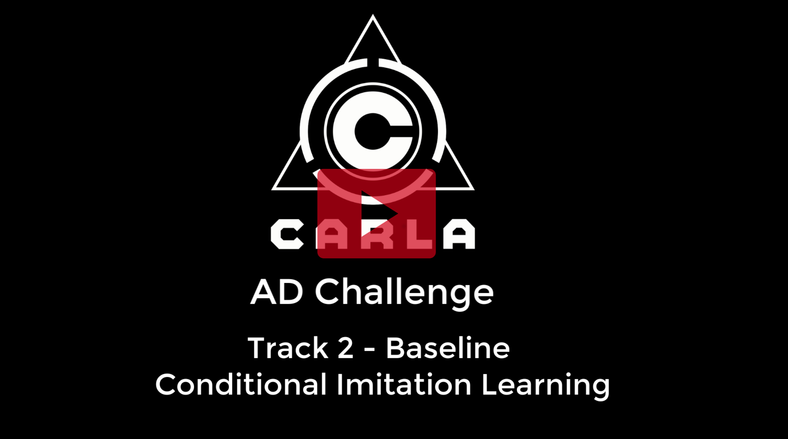

CARLA Challenge Track 2 Baseline - Conditional Imitation Learning
============

CARLA Challenge Test Results
-----------------------------
We keep an updated score for the current challenge tasks:

| Challenge Basic:  | AVG Score 34.70 |
|-------------------|--------|

Running the Baseline
----------

### Preparation

Clone the repository:

    git clone https://github.com/felipecode/coiltraine.git 
    cd coiltraine

We provide a conda environment requirements file, to
install and activate, just run:

    conda env create -f requirements.yaml
    conda activate coiltraine

Download the agent pytorch checkpoint by running the following script:

    python3 tools/download_sample_models.py

The checkpoints should now be allocated already on the proper folders.

Download the [latest CARLA 0.9.x version](https://github.com/carla-simulator/carla/blob/master/Docs/download.md).
Then, after unpacking it,  define where the root folder was placed:

    export CARLA_ROOT=<path_to_carla_root>

Install the latest CARLA API:

    easy_install ${CARLA_ROOT}/PythonAPI/carla/dist/*-py3.5-linux-x86_64.egg

Make sure you set the PYTHONPATH PythonAPI path:

     export PYTHONPATH=${CARLA_ROOT}/PythonAPI/carla:$PYTHONPATH
     

### Visualize the agent results 

First have the latest version of CARLA executing at some terminal at 40 fps (Recommend)

    sh CarlaUE4.sh Town03 -windowed -world-port=2000  -benchmark -fps=40
 

To run the and visualize the model run:

    python3 view_model.py  -f baselines -e resnet34imnet -cp 180000 -cv 0.9

After running, you will see on the bottom corner the activations of resnet intermediate
layers. You can command a destination for the agent by using the arrow keys from the keyboard.

### Get the agent performance on the CARLA Challenge

Clone the scenario  runner repository:
    
    cd
    git clone -b carla_challenge  https://github.com/carla-simulator/scenario_runner.git

Setup the scenario runner challenge repository by setting the path to your CARLA root
folder.

    cd scenario_runner
    bash setup_environment --carla-root <path_to_carla_root_folder>

Export the coiltraine path to the PYTHONPATH:

    cd ~/coitraine
    export PYTHONPATH=`pwd`:$PYTHONPATH
    
Start the CARLA server on another terminal:

    ./CarlaUE4.sh -benchmark -fps=20 -quality-level=Epic

Execute the challenge with the conditional imitation learning baseline

     CHALLENGE_PHASE_CODENAME=dev_track_2 python3 ${ROOT_SCENARIO_RUNNER}/srunner/challenge/challenge_evaluator_routes.py \
    --scenarios=${ROOT_SCENARIO_RUNNER}/srunner/challenge/all_towns_traffic_scenarios1_3_4.json \
    --routes=${ROOT_SCENARIO_RUNNER}/srunner/challenge/routes_training.xml \
    --debug=0 \
    --agent=../coiltraine/drive/CoILBaseline.py \
    --config=../coiltraine/drive/sample_agent.json

Watch the results.

Training
---------

Define the datasets folder.
This is the folder that will contain your training and validation datasets

    export COIL_DATASET_PATH=<Path to where your dataset folders are>

Download the dataset:

    python3 tools/get_baseline_dataset.py

You can learn how to use the framework on the following [main tutorial](../README.md)
However, you can also do a single train of the model  using the
basic dataset:

    python3 coiltraine.py --single-process train -e resnet34imnet --folder baselines --gpus 0

To check images and train curves there is also a tensorboard log
being saved at "_logs" folder on the repository root.

